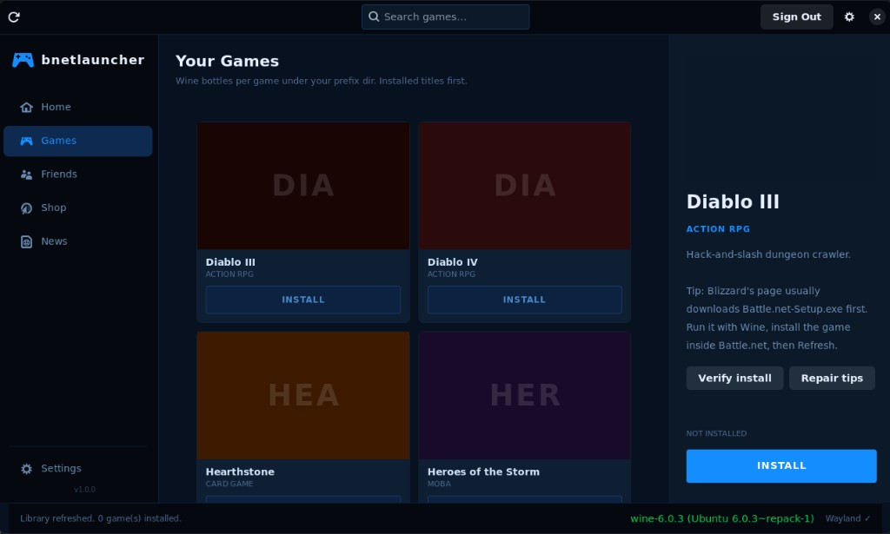

# bnetlauncher

Independent **GTK4 / libadwaita** launcher for **Blizzard games on Linux**. It is
**not** Blizzard's own desktop client. You get **per-game Wine prefixes** under
your configured directory, **Wayland-safe** launches, and browser or in-Wine
flows for installs using Blizzard's official tooling. **Not affiliated with or
endorsed by Blizzard.** The app and `.desktop` entry are named **bnetlauncher**
(avoid implying an official "Battle.net Launcher" product).

## Screenshot

Games library on Linux (Ubuntu, Wine, Wayland):



## Features

- **Wayland-native:** GTK4/libadwaita Wayland client; falls back to X11/XWayland.
- **Resize-safe launches:** Wine env tweaks to avoid `ChangeDisplaySettings` /
  XWayland crash loops.
- **Wine / Proton:** System Wine or Proton. Installs under `…/drive_c/…` use that
  bottle; game files on a normal Linux path (e.g. a mounted Windows drive) still
  **launch with the Blizzard desktop app’s prefix** (or `~/.wine`) so DLLs and
  registry match. Per-game directories under `wine_prefix_dir` are created when
  needed (see config).
- **Catalogue:** Detects common Blizzard installs under scanned prefixes and
  custom paths. Titles that are a poor fit for Linux/Wine (e.g. some
  anti-cheat FPS games) are **hidden by default**; enable **Settings → Library →
  Show unsupported titles** to list them.
- **Verify / repair hints:** **Games** detail panel includes **Verify install**
  (executable + prefix sanity) and **Repair tips** (Blizzard app Scan and Repair).
  For **World of Warcraft**, verify also checks that product folders (`_retail_`,
  `_classic_`, etc.) look sane for add-on paths.
- **World of Warcraft add-ons:** With WoW installed, the detail panel offers
  **Open Add-ons folder…** — pick **Retail**, **Classic**, or other detected
  flavors. The app creates `Interface/AddOns` if needed and opens it in your
  file manager (`xdg-open`). Install or update add-ons there (CurseForge,
  Wago, etc.); the launcher does not download add-ons for you.
- **Optional Blizzard API:** OAuth and developer credentials for metadata;
  works offline without them.
- **Hub pages:** Home, Friends, Shop, News (links open in browser, WSL-aware).
- **Settings:** Stored under **`$XDG_CONFIG_HOME/bnetlauncher/config.json`**
  (default **`~/.config/bnetlauncher/config.json`** if `XDG_CONFIG_HOME` is unset).

**Sidebar icons:** Shop and News use **`web-browser-symbolic`** and
**`help-contents-symbolic`** so they resolve on common Adwaita/icon-theme sets.
If an icon still appears missing, install your distro's full Adwaita icon pack
(e.g. `adwaita-icon-theme-full` on Debian/Ubuntu).

## Roadmap

- Further **WoW** quality-of-life (optional): shortcuts to per-flavor `WTF` config
  folders, or documented workflows with external add-on managers.

## Project layout

```
.
├── pyproject.toml
├── README.md
├── LICENSE
├── install.sh
├── docs/
│   └── screenshot.png
├── scripts/
│   └── check_imports.py          # optional: imports + GTK smoke test
├── tests/
│   ├── test_wow_addons.py
│   └── test_wine_runner.py       # python -m unittest discover -s tests -t .
└── bnetlauncher/
    ├── main.py                   # entry point; Wayland env before GTK
    ├── app.py                    # Adw.Application; CSS; actions
    ├── gtk_compat.py             # CSS / API shims (older GTK)
    ├── window.py                 # main window; games grid + detail tools
    ├── auth.py                   # OAuth2; browser open (WSL-aware)
    ├── config.py                 # JSON config (XDG paths)
    ├── game_manager.py           # catalogue, scan, SQLite, get_library_games()
    ├── install_health.py         # verify install paths; repair guidance
    ├── wow_addons.py             # WoW Interface/AddOns; xdg-open
    ├── wine_runner.py            # Wine/Proton launch; prefix resolution
    └── ui/
        ├── game_card.py
        ├── hub_pages.py
        ├── sidebar.py
        ├── settings.py
        └── style.css
```

## Requirements

| Package | Purpose |
|---------|---------|
| Python 3.10+ | Runtime (3.10 matches Ubuntu 22.04 LTS; 3.11+ also fine) |
| `python3-gi` | GTK4 Python bindings |
| `gir1.2-gtk-4.0` | GTK4 typelib |
| `gir1.2-adw-1` | libadwaita typelib |
| `wine` / `wine64` | Windows game compatibility |
| `winbind` / **Samba clients** | `ntlm_auth` on PATH: Debian/Ubuntu **`winbind`**, Fedora **`samba-winbind-clients`**, Arch **`samba`** (Battle.net / Wine installer often needs this) |
| `xwayland` | XWayland for Wine (most compositors bundle this) |

Optional: `winetricks`, `dxvk`, Proton (from Steam)

**Distro versions:** The code adapts to older GTK/libadwaita (tested on Ubuntu 22.04: GTK 4.6, libadwaita 1.1). `style.css` avoids CSS that older GTK parsers reject (e.g. `justify-content` on buttons).

## Installation

```bash
git clone https://github.com/Cod-e-Codes/bnetlauncher
cd bnetlauncher
bash install.sh
```

`install.sh` detects your distro (Ubuntu, Debian, Fedora, Arch, openSUSE, and
common derivatives such as Mint or Pop!_OS) and installs system packages
(including **Wine**, **`ntlm_auth`** via winbind/Samba where needed, and
**python3-pip** on Debian-based distros). It upgrades **pip / setuptools /
wheel** before an editable install (PEP 660), appends **`~/.local/bin`** to
`~/.bashrc` when needed, and ensures **Wine** is present even if GTK packages
were already installed.

**Manual install** (match your distro’s packages to `install.sh` where possible):

```bash
# Ubuntu / Debian
sudo apt install python3-pip python3-gi python3-gi-cairo \
  gir1.2-gtk-4.0 gir1.2-adw-1 wine wine64 winbind xwayland winetricks

# Arch / Manjaro (samba provides ntlm_auth)
sudo pacman -S python-gobject gtk4 libadwaita wine winetricks samba xorg-xwayland

# Fedora
sudo dnf install python3-gobject gtk4 libadwaita wine winetricks \
  samba-winbind-clients xorg-x11-server-Xwayland

# openSUSE
sudo zypper install python3 python3-gobject typelib-1_0-Gtk-4_0 typelib-1_0-Adw-1 \
  wine samba-winbind xwayland

pip install --user -e .
```

**Packaging note:** The project uses `setuptools.build_meta` as the build backend (PEP 517). Use a current `pip`/`setuptools` if editable installs fail with a missing `build_editable` hook.

## Developing on Windows

This application is **Linux-only** (GTK4/Wayland). On Windows you can still:

1. **Sanity-check syntax:** `python -m compileall -q bnetlauncher`
2. **Unit tests (no GTK):** `python -m unittest discover -s tests -t . -v`
3. **Install the package:** `pip install -e .` (confirms `pyproject.toml` / packaging)
4. **Run the real UI under WSL2** (Ubuntu 22.04 or newer recommended):

   ```bash
   sudo apt update
   sudo apt install -y python3-gi python3-gi-cairo gir1.2-gtk-4.0 gir1.2-adw-1 \
     python3-pip wine wine64 winbind xwayland
   cd /mnt/c/Users/YOU/Projects/bnetlauncher   # adjust path
   python3 -m pip install --user --upgrade pip setuptools wheel
   pip3 install --user -e .
   python3 scripts/check_imports.py
   bnetlauncher
   ```

   Run these **inside WSL** (e.g. after `wsl` from PowerShell), not in Windows
   PowerShell alone: `apt`, `python3`, and `/mnt/c/...` are Linux-only.

   WSLg provides a display server on recent Windows 10/11; you may see harmless
   graphics-driver messages in the terminal.

   After **Sign In**, if the browser reports a connection error to
   `localhost:6547`, see [Blizzard developer API (optional OAuth)](#blizzard-developer-api-optional-oauth).

## Usage

```bash
bnetlauncher
```

Or launch from your desktop grid: `install.sh` places a `.desktop` file in
`~/.local/share/applications/`.

Use the **sidebar** for **Home**, **Games**, **Friends**, **Shop**, and **News**.
The header **search** applies only on **Games**.

### Blizzard developer API (optional OAuth)

1. Register at <https://develop.battle.net> and create an application (confidential client with a client secret).
2. Set the **redirect URI** to exactly **`http://localhost:6547/callback`**. Scheme, host, port, and path must match (no `https`, no trailing slash).
3. In the launcher: **Settings → Authentication**, enter **Client ID** and **Client Secret**, region if needed.
4. **Sign In.** A browser opens; after approval, the app receives the callback on **port 6547** and exchanges the code for tokens.

**Account button:** The header shows **Sign Out** whenever an **access token is saved** (even if it is expired or the system clock is wrong). **API calls** still require a **non-expired** token; if the clock is skewed, sign out and sign in again after fixing time sync.

**OAuth:** The callback server listens on **`0.0.0.0:6547`** so **WSL2** can receive redirects when the browser runs on Windows.

**Debug:** Set **`BNETLAUNCHER_DEBUG=1`** to print **config load/save errors** to **stderr** (secrets and tokens are not logged).

**Opening links (WSL):** If Windows **interop** is enabled (`[interop] enabled=true` in `/etc/wsl.conf`, then `wsl --shutdown` from Windows), the app can launch Windows `rundll32` / PowerShell / etc. If you see **`Exec format error`** for `/mnt/c/.../*.exe`, interop is off: install a **Linux** browser (`sudo apt install firefox`) or fix interop. The app then tries `wslview`, Python `webbrowser`, `xdg-open`, `gio`, and common browser binaries. Only `webbrowser.open()` returning **`True`** counts as success. If opening fails, the URL is printed to **`stderr`**; for **Sign In**, the server **keeps running** so you can paste the URL manually.

If sign-in times out or you see "connection refused" on the callback, use current **Windows 11 + WSL2** with localhost forwarding, run on **native Linux**, or free port **6547**.

**Windows shell:** Do not paste `pip install setuptools>=68` into **cmd.exe** unquoted; `>` redirects. Use WSL/bash or quote (`"setuptools>=68"`).

Without API credentials, local library and Wine features still work.

### Installing games

The app does **not** download full game payloads. **INSTALL** opens Blizzard's
**download page** (often **`Battle.net-Setup.exe`**, not a standalone game
installer). Install the Blizzard desktop app in Wine, then the game inside it, then **Refresh**
here.

If the Blizzard agent (**Battle.net.exe** / similar) is found under scanned prefixes, the app can start it in
Wine while the page opens. See earlier README versions in git history for WSL
browser troubleshooting.

### Adding games manually

Use **Settings → Library → Extra scan folders** to add directories that contain
Blizzard game roots (e.g. the parent of `World of Warcraft/`). Paths are stored
in `custom_game_paths` in the config file. Click **Refresh** (or change
**Show unsupported titles**) to rescan the library.

**Launch prefix:** If the game `.exe` is not under a Wine `drive_c` tree, the
launcher runs it with the **same `WINEPREFIX` as the Blizzard desktop app**
(when detected), not an empty per-game bottle.

### World of Warcraft add-ons

1. Install WoW (in Wine or on a mounted drive) so **bnetlauncher** can find
   `Wow.exe` or `WowClassic.exe` under `World of Warcraft/_retail_` or
   `World of Warcraft/_classic_` (and other `_…_` product folders Blizzard adds).
   Use **Extra scan folders** if the game lives outside the scanned Wine prefixes.
2. Select **World of Warcraft** in **Games**, then **Open Add-ons folder…** and
   choose the product line (e.g. **Retail** or **Classic**).
3. The launcher ensures `Interface/AddOns` exists and opens that directory. Drop
   unpacked add-on folders there (each add-on is a folder with a `.toc` file).
4. **Verify install** includes a light check that those paths are not broken
   (for example `Interface` accidentally being a file).

Requires **`xdg-open`** on your PATH (standard on desktop Linux). The launcher
does not install CurseForge/Wago clients or download add-on archives.

## Source archive

From a clean checkout (excludes `__pycache__` and `*.egg-info`):

```bash
tar -czf bnetlauncher.tar.gz \
  --exclude='__pycache__' \
  --exclude='*.egg-info' \
  pyproject.toml README.md LICENSE install.sh docs bnetlauncher scripts tests
```

## Wayland / resize safety

See `wine_runner.py` for `WINE_FULLSCREEN_FAKE_FULLSCREEN`, DXVK, esync/fsync,
SDL on X11, etc. **Virtual Desktop** in Settings trades integration for maximum
stability.

The launcher does not set Mesa’s `MESA_GL_VERSION_OVERRIDE` or
`MESA_GLSL_VERSION_OVERRIDE`; export them yourself if a specific game needs them.
If Wine crashes or performs badly inside a **VM**, try **DXVK** off and
**Virtual desktop** on under **Settings → Wine**, and give the guest enough
video RAM.

## Configuration file

**`$XDG_CONFIG_HOME/bnetlauncher/config.json`** (same as **`~/.config/...`** by default).
Example keys (defaults use **`wine`** for `wine_executable`; set **`wine64`** if that is your preferred binary):

```json
{
  "bnet_client_id": "...",
  "bnet_client_secret": "...",
  "wine_executable": "wine",
  "wine_prefix_dir": "/home/you/.local/share/bnetlauncher/prefixes",
  "show_unsupported_games": false,
  "dxvk_enabled": true,
  "esync_enabled": true,
  "fsync_enabled": true,
  "fake_fullscreen": true,
  "force_borderless": true,
  "virtual_desktop": false,
  "virtual_desktop_res": "1920x1080",
  "fsr_enabled": false,
  "custom_game_paths": ["/mnt/games/blizzard"]
}
```

## License

MIT. See `LICENSE`.
